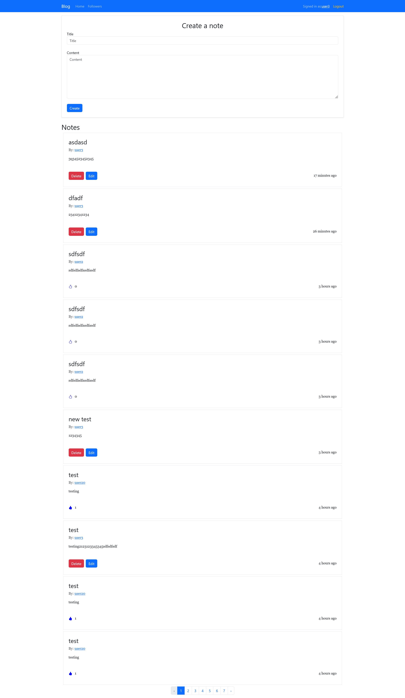
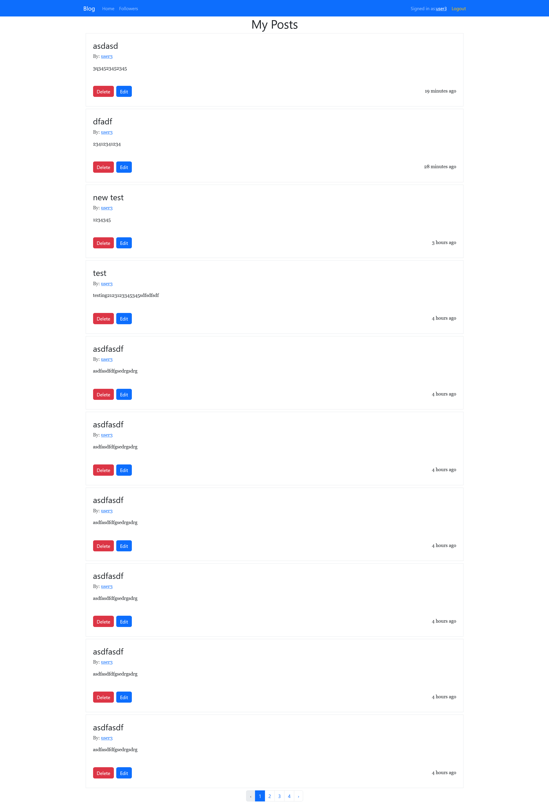
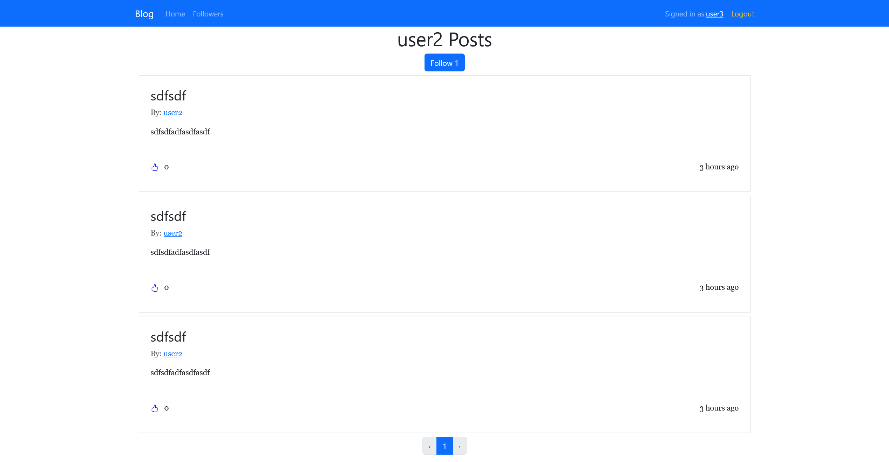

# Social Network Application

This is a full-stack social network application built with React and Django. Users can register, create notes, follow other users, and like notes. Screenshots of the application are available below.

## Features

- User registration and authentication
- Create, edit, and delete notes
- Follow and unfollow users
- Like and unlike notes
- Pagination for notes
- Responsive design

## Technologies Used

- Frontend: React, React Router, Axios, Bootstrap
- Backend: Django, Django REST Framework, Simple JWT
- Database: SQLite (default, can be changed to PostgreSQL or other databases)

## Setup Instructions

### Prerequisites

- Node.js and npm
- Python and pip
- Django

### Backend Setup

#### 1. Clone the repository

```bash
git clone https://github.com/leonti98/django_react.git
```

#### 2. Change directory

```bash
cd backend
```

#### 3. Install Python dependencies

```bash
pip install -r requirements.txt
```

#### 4. Migrations, superuser and runserver

1. make migrations

   ```bash
   python manage.py makemigrations
   ```

2. Apply migrations:

   ```sh
   python manage.py migrate
   ```

3. Create a superuser:

   ```sh
   python manage.py createsuperuser
   ```

4. Run the development server:

   ```sh
   python manage.py runserver
   ```

### Frontend Setup

1. Navigate to the frontend directory:

   ```sh
   cd frontend
   ```

2. Install the required packages:

   ```sh
   npm install
   ```

3. Create a `.env` file in the frontend directory and add the API URL:

   ```sh
   VITE_API_URL=http://127.0.0.1:8000
   ```

4. Run the development server:

   ```sh
   npm run dev
   ```

### Running the Application

1. Ensure both the backend and frontend servers are running.
2. Open your browser and navigate to `http://localhost:3000` to access the application.

## Project Structure

### Backend

- `api/`: Contains the Django app for the API.
- `backend/`: Contains the Django project configuration.

### Frontend

- `src/`: Contains the React application source code.
  - `components/`: Reusable React components.
  - `pages/`: React components for different pages.
  - `styles/`: CSS files for styling.
  - `api.js`: Axios instance for API requests.
  - `helpers.js`: Helper functions.

## API Endpoints

### User Endpoints

- **POST /api/user/register/**: Register a new user.

  - Request body: `{ "username": "string", "password": "string" }`
  - Response: `{ "id": "integer", "username": "string", "followers": [] }`

- **POST /api/token/**: Obtain a JWT token.

  - Request body: `{ "username": "string", "password": "string" }`
  - Response: `{ "access": "string", "refresh": "string" }`

- **POST /api/token/refresh/**: Refresh the JWT token.

  - Request body: `{ "refresh": "string" }`
  - Response: `{ "access": "string" }`

- **GET /api/user/:id/**: Get user information.

  - Response: `{ "id": "integer", "username": "string", "followers": [] }`

- **PUT /api/user/follow/:id/**: Follow or unfollow a user.
  - Response: `{ "followed": "boolean" }`

### Note Endpoints

- **GET /api/notes/**: List all notes.

  - Query parameters: `filters` (optional JSON string for filtering)
  - Response: List of notes

- **POST /api/notes/**: Create a new note.

  - Request body: `{ "title": "string", "content": "string" }`
  - Response: `{ "id": "integer", "title": "string", "content": "string", "author": "integer", "created_at": "datetime", "likes": [], "likes_count": "integer" }`

- **PUT /api/notes/edit/:id/**: Edit a note.

  - Request body: `{ "title": "string", "content": "string" }`
  - Response: `{ "id": "integer", "title": "string", "content": "string", "author": "integer", "created_at": "datetime", "likes": [], "likes_count": "integer" }`

- **DELETE /api/notes/:id/**: Delete a note.

  - Response: `{ "id": "integer", "title": "string", "content": "string", "author": "integer", "created_at": "datetime", "likes": [], "likes_count": "integer" }`

- **PUT /api/notes/like/:id/**: Like or unlike a note.

  - Response: `{ "liked": "boolean" }`

- **GET /api/user/:user_id/notes/**: List notes of a specific user.

  - Response: List of notes

- **GET /api/notes/followers/**: List notes from followed users.
  - Response: List of notes

## Authenification URLs

- **/admin/**: Django admin interface.
- **/api/user/register/**: Register a new user.
- **/api/token/**: Obtain a JWT token.
- **/api/token/refresh/**: Refresh the JWT token.
- **/api-auth/**: Django REST framework login/logout.

## Screenshots

### Home



### User Profile



### Other user's profile


